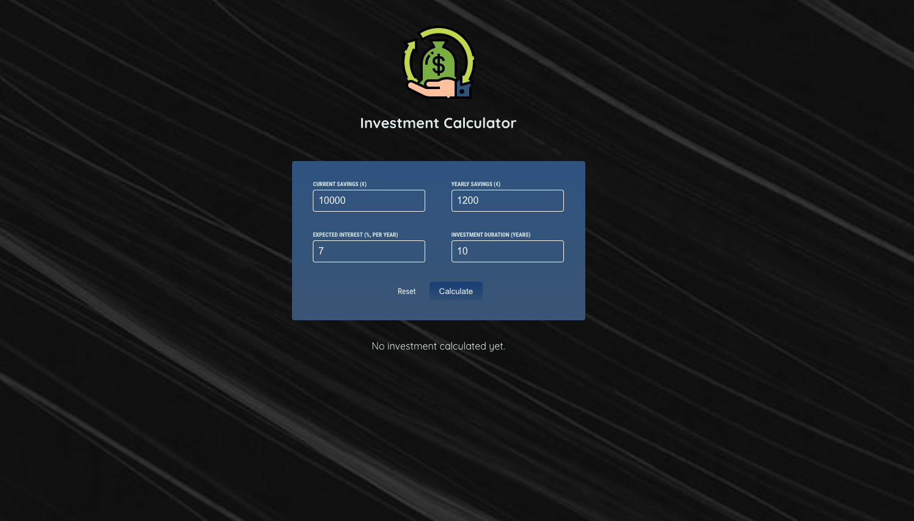
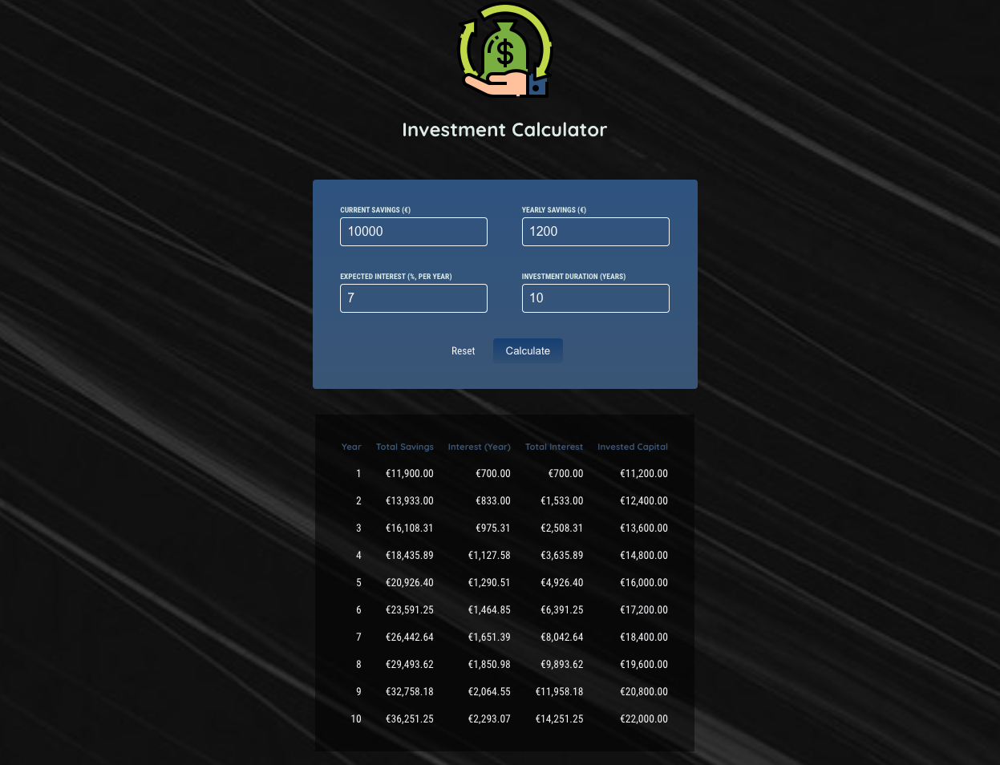

# Investments-Calculator

This is a simple JavaScript and React application that allows you to calculate the growth of your investments over a specified duration. The app is composed of three main components: `Header`, `UserInput`, and `ResultsTable`.

## Components

`App`

- The App component serves as the main container for the entire application. It manages the state of user input and displays the results in the ResultsTable component.

`UserInput`

- The UserInput component allows you to input your initial savings, yearly contributions, expected annual return, and investment duration. Click the "Calculate" button to see the investment growth over time. You can also reset the input fields to their default values by clicking the "Reset" button.

`ResultsTable`

- The ResultsTable component displays a table that shows the investment growth over the specified duration. It includes columns for the year, total savings, yearly interest, total interest, and invested capital.

## Default Input Values

By default, the application is set with the following initial values in the UserInput component:

- Current Savings (€): 10,000
- Yearly Savings (€): 1,200
- Expected Interest (% per year): 7
- Investment Duration (years): 10
- Feel free to modify these values in the input fields to calculate the investment results based on your own financial scenario.

## Example Image

Here's a screenshot of the application in action:

